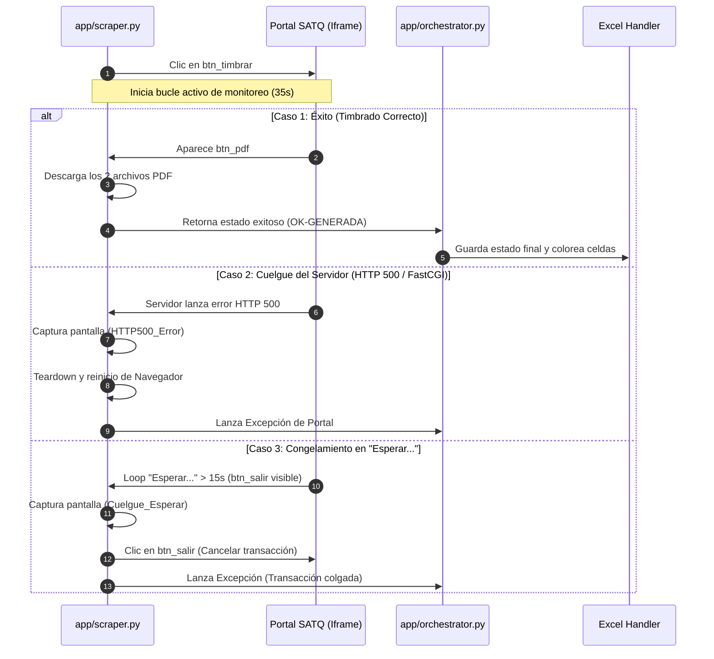

# Timbrar Button – Flujo de Trabajo, Validaciones, Fallos y Políticas de Reintento (v1.1.0)

> **Objetivo**: Documentar el flujo de trabajo completo, técnico y operativo que ocurre en el motor de automatización (Playwright) y en el orquestador inmediatamente después de que el bot ejecuta el clic en el botón de **Timbrar** del portal SATQ.

---

## 1. Diagrama de Secuencia del Timbrado



---

## 2. Flujo Paso a Paso tras el Clic en "Timbrar"

En el momento en que se aprueba el timbrado (en modo asistido o autónomo), el bot ejecuta los siguientes pasos secuenciales:

1. **Clic en Botón de Timbrar:** El bot lee el selector `btn_timbrar` desde `settings.json` y ejecuta:
   ```python
   btn_timbrar.click()
   ```
2. **Entrada en Bucle de Monitoreo Activo:** Se inicia un temporizador de **35 segundos** donde, en intervalos de 1 segundo, se consulta el estado de la página.

---

## 3. Pruebas de Errores y Mitigaciones en el Bucle

Durante el monitoreo, el bot busca activamente tres posibles escenarios de falla o éxito:

### 3.1 Detección de Éxito
* **Fórmula:** Si aparece en pantalla el componente del selector `btn_pdf`.
* **Acción:** Rompe el bucle, descarga los 2 PDFs y devuelve la confirmación de éxito.

### 3.2 Mitigación de Error HTTP 500 / FastCGI Timeout
* **Fórmula:** El portal SATQ colapsa y responde con "HTTP Error 500.0", "FastCGI" o "Internal Server Error" en el código HTML de la página.
* **Acción:**
  1. Captura evidencia en la carpeta `screenshots/`.
  2. Fuerza un reinicio total de la sesión del navegador para limpiar la conexión.
  3. Lanza una excepción que dispara la política de reintentos.

### 3.3 Mitigación de Congelamiento en "Esperar..."
* **Fórmula:** El portal se queda cargando indefinidamente con el spinner "Esperar..." por más de 15 segundos, pero el botón **Salir** (`btn_salir`) está visible en el DOM.
* **Acción:**
  1. Captura evidencia de cuelgue.
  2. Hace clic en el botón de **Salir** en el portal para cancelar la transacción y evitar que la referencia quede bloqueada en el servidor.
  3. Lanza una excepción para reintentar desde un estado limpio.

### 3.4 Inmunidad ante "Execution context was destroyed"
* **Fórmula:** Durante una recarga del portal, Playwright pierde temporalmente el enlace con el `iframe` principal.
* **Acción:** El bot captura esta excepción específica de Playwright, registra un warning en los logs y **vuelve a localizar el iframe activo del portal** dinámicamente, continuando la espera sin interrumpir la ejecución.

---

## 4. Políticas de Reintento Avanzadas

Si el bucle de timbrado lanza una excepción controlada debido a un error de portal (HTTP 500, Cuelgue, o pérdida de conexión):

1. **Reinicio de Navegador en Reintentos:** En lugar de realizar una simple recarga de página (que mantendría la conexión de red corrupta o el hilo colgado), el bot ejecuta:
   ```python
   self.reiniciar_sesion_navegador()
   ```
   Esto cierra por completo el proceso de Chrome/Edge, abre una ventana nueva e inicia la conexión desde cero utilizando el perfil persistente de cookies.
2. **Límite de Reintentos:** El bot permite hasta **2 reintentos automáticos** (configurable mediante `"max_timbrado_retries"` en `settings.json`).
3. **Escalamiento a Pausa:** Si tras agotar los reintentos el error persiste, el bot:
   * Escribe el estado `ERROR_REINTENTABLE` en la fila correspondiente en Excel.
   * Pausa de forma segura la ejecución.
   * Emite una alerta visual en la consola de logs para que el operador humano verifique e intervenga de ser necesario.
