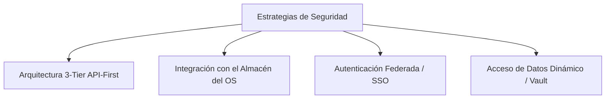

# SAR-SEC-003: Estándares y Estrategias para la Protección de Credenciales en Clientes
**Categoría:** Seguridad de la Información  
**Versión:** 1.0  
**Estado:** Propuesto  
**Metodología:** Business-First Architecture (BFA)

---

## 1. Introducción
El almacenamiento de credenciales en texto plano (como archivos `.env`, `.ini` o variables de entorno del sistema) en estaciones de trabajo de usuarios finales presenta un vector de ataque crítico. Si un equipo es vulnerado, un atacante o malware podría extraer las credenciales y comprometer el servidor central de base de datos. 

Este documento detalla las estrategias profesionales y empresariales para evitar la exposición de secretos en los equipos clientes de SAR.

---

## 2. Estrategias de Mitigación y Arquitectura



### 2.1. Arquitectura de 3 Capas (3-Tier API-First) - *La Solución Definitiva*
Es la práctica estándar de la industria. Consiste en eliminar por completo la conexión directa de la aplicación de escritorio (`PySide6`) a la base de datos PostgreSQL.

* **Cómo funciona:** 
  1. El cliente de escritorio solo realiza peticiones HTTPS a la API de **FastAPI**.
  2. La API de FastAPI (alojada de manera segura en el servidor) es la única que tiene las credenciales del motor de base de datos.
  3. El cliente se autentica contra la API usando **JWT (JSON Web Tokens)** con una duración de vida corta (ej. 15 minutos).
* **Ventajas:** 
  * Seguridad absoluta: La base de datos no se expone a la red local directamente (el puerto 5432 se cierra al exterior y solo acepta peticiones locales de la API).
  * Control total del tráfico mediante endpoints.

---

### 2.2. Uso del Almacén de Credenciales del Sistema Operativo (OS Keyring)
Si es estrictamente necesario mantener la arquitectura de conexión directa por temas de velocidad de desarrollo o fase de pruebas, **nunca** guarde las credenciales en archivos de texto. Utilice la API criptográfica nativa del sistema operativo.

* **Windows:** Windows Credential Manager (a través de **DPAPI** - Data Protection API), el cual encripta los datos utilizando la clave del usuario de Windows actual.
* **Implementación en Python:** Se utiliza la librería estándar del ecosistema `keyring`.
  ```python
  import keyring

  # Guardar la credencial de forma segura en el Administrador de Credenciales de Windows
  keyring.set_password("sistema_sar", "sar_user", "ContraseñaSegura123#")

  # Recuperar la credencial en tiempo de ejecución
  db_password = keyring.get_password("sistema_sar", "sar_user")
  ```
* **Ventajas:** La contraseña se guarda cifrada por el propio Windows y solo el usuario que la registró puede extraerla bajo su sesión activa.

---

### 2.3. Autenticación Federada y Single Sign-On (SSO / Active Directory)
En entornos corporativos, las aplicaciones no deben manejar contraseñas independientes. En su lugar, se delega la identidad al directorio activo de la empresa.

* **Kerberos / Integrated Windows Authentication (IWA):**
  PostgreSQL soporta autenticación mediante **GSSAPI/SSPI** (Active Directory).
* **Cómo funciona:**
  Cuando el usuario inicia sesión en su computadora Windows con su cuenta de la empresa, PostgreSQL valida la identidad a través del token de seguridad de Windows.
* **Ventajas:** El usuario no ingresa contraseñas adicionales y la aplicación SAR no almacena ningún secreto en el cliente.

---

### 2.4. Tokens Dinámicos de Base de Datos (IAM / Vault)
Para entornos híbridos o en la nube, se eliminan las contraseñas estáticas en favor de credenciales de corta duración generadas a demanda.

* **Herramientas:** HashiCorp Vault, AWS Secrets Manager, GCP Secret Manager.
* **Cómo funciona:**
  La aplicación cliente solicita acceso al orquestador de secretos mediante su identidad de máquina. El orquestador genera dinámicamente un usuario temporal en PostgreSQL con permisos específicos y una duración de vida de 1 hora, devolviendo las credenciales temporales al cliente.

---

## 3. Matriz de Decisión y Madurez de Seguridad

| Estrategia | Complejidad de Implementación | Nivel de Seguridad | Recomendado para |
| :--- | :--- | :--- | :--- |
| **Archivos `.env` protegidos por ACL** | Muy Baja | Bajo | Pruebas de desarrollo rápidas e individuales. |
| **Librería `keyring` (OS)** | Baja | Medio-Alto | Fase de pruebas beta con pocos usuarios (conexión directa). |
| **Arquitectura API (FastAPI)** | Media-Alta | Excelente (Estándar) | Entorno de producción distribuido. |
| **Active Directory (SSPI)** | Alta | Excelente | Entorno corporativo cerrado (Windows). |
