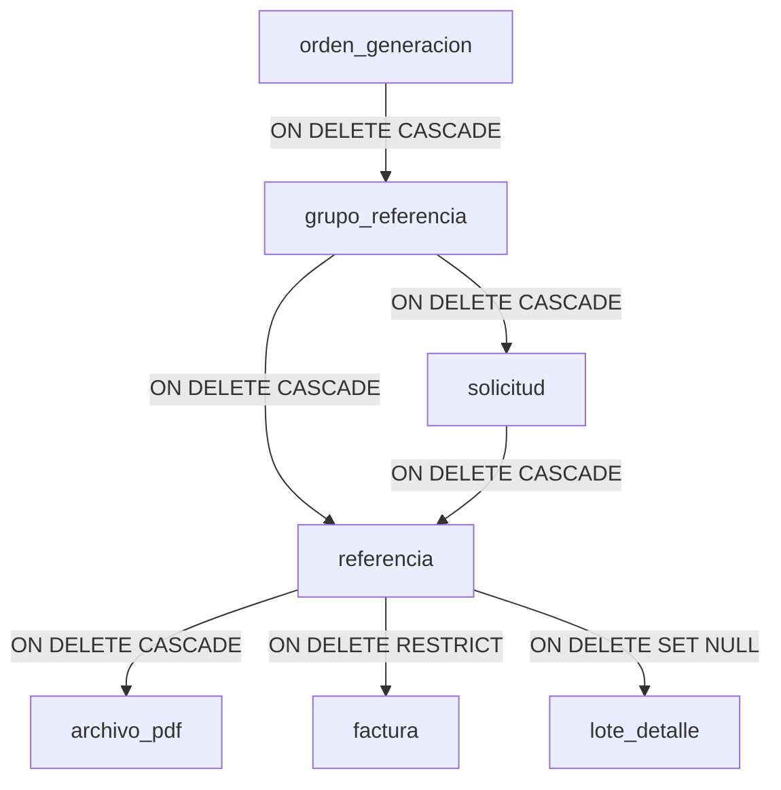

# Procedimiento de Eliminación Segura de Órdenes (SAR)

Este documento detalla el procedimiento técnico y el script SQL necesario para eliminar de forma segura una orden de generación del sistema, resguardando la integridad referencial y recalibrando las secuencias de autoincremento correspondientes en la base de datos de PostgreSQL.

---

## 1. Análisis de Dependencias y Cascada

Debido al diseño físico del esquema de base de datos del **Sistema de Administración de Referencias (SAR)**, los registros correspondientes a una orden se encuentran altamente relacionados:



### Comportamiento ante la eliminación:
* **En cascada (`ON DELETE CASCADE`):** Al borrar un registro en `orden_generacion`, PostgreSQL eliminará automáticamente sus grupos, solicitudes, referencias y archivos PDF vinculados.
* **Restringido (`ON DELETE RESTRICT`):** La tabla `factura` bloquea la eliminación de cualquier referencia que ya cuente con una factura emitida. Por ende, **es obligatorio eliminar primero las facturas relacionadas**.
* **Puesta a nulo (`ON DELETE SET NULL`):** La tabla `lote_detalle` (asignaciones) desvincula la referencia colocando su `referencia_id` en `NULL`. Para limpiar por completo la asignación, se puede optar por borrar los registros del detalle explícitamente.

---

## 2. Script SQL de Eliminación Segura y Recalibración

El siguiente script utiliza transaccionalidad para asegurar que los cambios se apliquen por completo o no se apliquen en absoluto en caso de error. 

> [!IMPORTANT]
> Reemplaza el valor de la variable de control `v_orden_id` (en este ejemplo configurada a `2`) con el identificador de la orden que deseas eliminar.

```sql
DO $$
DECLARE
    -- ID de la orden que se desea eliminar
    v_orden_id CONSTANT BIGINT := 2; 
BEGIN
    RAISE NOTICE 'Iniciando eliminación segura para orden_id: %', v_orden_id;

    -- =========================================================================
    -- PASO 1: Eliminar facturas asociadas a las referencias de la orden
    -- =========================================================================
    DELETE FROM sar_archivo.factura
    WHERE referencia_id IN (
        SELECT r.referencia_id
        FROM sar_produccion.referencia r
        JOIN sar_produccion.grupo_referencia gr ON r.grupo_id = gr.grupo_id
        WHERE gr.orden_id = v_orden_id
    );

    -- =========================================================================
    -- PASO 2: Eliminar detalles de lote (asignaciones) de la orden
    -- =========================================================================
    DELETE FROM sar_archivo.lote_detalle
    WHERE referencia_id IN (
        SELECT r.referencia_id
        FROM sar_produccion.referencia r
        JOIN sar_produccion.grupo_referencia gr ON r.grupo_id = gr.grupo_id
        WHERE gr.orden_id = v_orden_id
    );

    -- =========================================================================
    -- PASO 3: Eliminar la orden de generación (desencadena cascada)
    -- =========================================================================
    DELETE FROM sar_produccion.orden_generacion
    WHERE orden_id = v_orden_id;

    -- =========================================================================
    -- PASO 4: Recalibrar secuencias de autoincremento
    -- Ajusta el puntero de las secuencias al valor máximo real + 1
    -- =========================================================================
    PERFORM setval(
        COALESCE(pg_get_serial_sequence('sar_produccion.orden_generacion', 'orden_id'), 'sar_produccion.orden_generacion_orden_id_seq'), 
        COALESCE((SELECT MAX(orden_id) FROM sar_produccion.orden_generacion), 0) + 1, 
        false
    );
    
    PERFORM setval(
        COALESCE(pg_get_serial_sequence('sar_produccion.grupo_referencia', 'grupo_id'), 'sar_produccion.grupo_referencia_grupo_id_seq'), 
        COALESCE((SELECT MAX(grupo_id) FROM sar_produccion.grupo_referencia), 0) + 1, 
        false
    );
    
    PERFORM setval(
        COALESCE(pg_get_serial_sequence('sar_produccion.solicitud', 'solicitud_id'), 'sar_produccion.solicitud_solicitud_id_seq'), 
        COALESCE((SELECT MAX(solicitud_id) FROM sar_produccion.solicitud), 0) + 1, 
        false
    );
    
    PERFORM setval(
        COALESCE(pg_get_serial_sequence('sar_produccion.referencia', 'referencia_id'), 'sar_produccion.referencia_referencia_id_seq'), 
        COALESCE((SELECT MAX(referencia_id) FROM sar_produccion.referencia), 0) + 1, 
        false
    );
    
    PERFORM setval(
        COALESCE(pg_get_serial_sequence('sar_archivo.factura', 'factura_id'), 'sar_archivo.factura_factura_id_seq'), 
        COALESCE((SELECT MAX(factura_id) FROM sar_archivo.factura), 0) + 1, 
        false
    );
    
    PERFORM setval(
        COALESCE(pg_get_serial_sequence('sar_archivo.archivo_pdf', 'archivo_id'), 'sar_archivo.archivo_pdf_archivo_id_seq'), 
        COALESCE((SELECT MAX(archivo_id) FROM sar_archivo.archivo_pdf), 0) + 1, 
        false
    );

    RAISE NOTICE 'Proceso completado exitosamente para orden_id: %', v_orden_id;
END $$;
```

---

## 3. Consultas de Verificación

Posterior a la ejecución, puedes correr estas consultas rápidas para confirmar que los datos se limpiaron de forma exitosa y no quedaron registros huérfanos:

```sql
-- Deberían retornar 0 registros
SELECT COUNT(*) FROM sar_produccion.orden_generacion WHERE orden_id = 2;
SELECT COUNT(*) FROM sar_produccion.grupo_referencia WHERE orden_id = 2;

-- Verificación indirecta por llaves foráneas
SELECT COUNT(*) FROM sar_produccion.solicitud s 
LEFT JOIN sar_produccion.grupo_referencia gr ON s.grupo_id = gr.grupo_id 
WHERE gr.grupo_id IS NULL;

SELECT COUNT(*) FROM sar_produccion.referencia r 
LEFT JOIN sar_produccion.grupo_referencia gr ON r.grupo_id = gr.grupo_id 
WHERE gr.grupo_id IS NULL;
```
