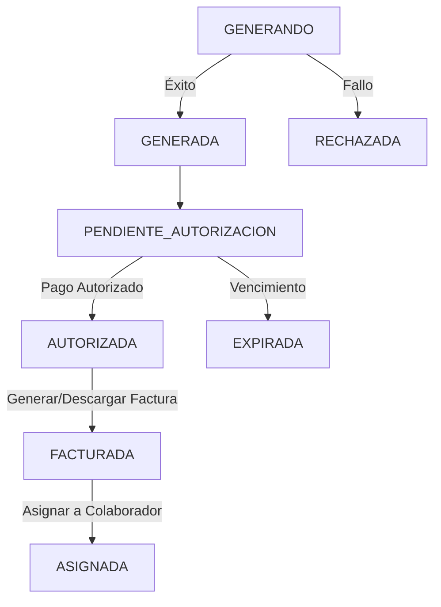

# SAR-DAT-001
# Modelo de Datos Empresarial y Físico
## Sistema de Administración de Referencias (SAR)

**Documento:** SAR-DAT-001  
**Versión:** 1.0  
**Estado:** Baseline Congelada  
**Metodología:** Business-First Architecture (BFA)  
**Fecha:** 2026

---

# 1. Objetivo

Definir el modelo de datos empresarial y físico del Sistema de Administración de Referencias (SAR), garantizando:

- Integridad de datos.
- Escalabilidad.
- Trazabilidad completa.
- Concurrencia segura.
- Auditoría de extremo a extremo.
- Soporte para procesamiento distribuido mediante Workers.
- Generación masiva de referencias.
- Control documental de referencias y facturas.

---

# 2. Principios de Diseño

## PD-001

La entidad principal del sistema es:

```text
REFERENCIA
```

---

## PD-002

Toda referencia debe poder rastrearse hasta su origen.

```text
ORDEN_GENERACION
    ↓
GRUPO_REFERENCIA
    ↓
SOLICITUD
    ↓
REFERENCIA
```

---

## PD-003

Todo catálogo deberá ser parametrizable.

No se permiten valores hardcodeados.

---

## PD-004

Toda operación relevante deberá quedar auditada.

---

## PD-005

El sistema deberá soportar múltiples Workers procesando simultáneamente.

---

## PD-006

La generación de consecutivos deberá ser transaccional y libre de colisiones.

---

# 3. Modelo Conceptual

```text
CAT_RFC
     │
     ▼
ORDEN_GENERACION
     │
     ▼
GRUPO_REFERENCIA
     │
     ▼
SOLICITUD
     │
     ▼
REFERENCIA
     │
     ▼
AUTORIZACION
     │
     ▼
FACTURA
     │
     ▼
ASIGNACION
```

---

# 4. Catálogos

## 4.1 CAT_RFC

Representa la información fiscal utilizada para generar referencias.

### Estructura

| Campo | Tipo |
|---------|---------|
| RFC_ID | BIGINT PK |
| RFC | VARCHAR(13) |
| RAZON_SOCIAL | VARCHAR(250) |
| CALLE | VARCHAR(250) |
| NO_EXTERIOR | VARCHAR(50) |
| NO_INTERIOR | VARCHAR(50) |
| COLONIA | VARCHAR(250) |
| LOCALIDAD | VARCHAR(250) |
| MUNICIPIO_ID | BIGINT |
| ENTIDAD_ID | BIGINT |
| CP | VARCHAR(10) |
| ACTIVO | BIT |
| FECHA_CREACION | DATETIME |
| FECHA_ACTUALIZACION | DATETIME |

### Restricciones

```sql
UNIQUE(RFC)
```

---

## 4.2 CAT_CONCEPTO

### Estructura

| Campo | Tipo |
|---------|---------|
| CONCEPTO_ID | BIGINT PK |
| CLAVE_PORTAL | VARCHAR(50) |
| NOMBRE | VARCHAR(250) |
| ACTIVO | BIT |

### Ejemplos

```text
Análisis y Calificación
Aviso Preventivo
CLG
```

---

## 4.3 CAT_DELEGACION

### Estructura

| Campo | Tipo |
|---------|---------|
| DELEGACION_ID | BIGINT PK |
| CLAVE_PORTAL | VARCHAR(50) |
| NOMBRE | VARCHAR(200) |
| ACTIVO | BIT |

### Ejemplos

```text
Cancún
Playa del Carmen
Chetumal
```

---

## 4.4 CAT_MUNICIPIO

### Estructura

| Campo | Tipo |
|---------|---------|
| MUNICIPIO_ID | BIGINT PK |
| NOMBRE | VARCHAR(150) |
| ACTIVO | BIT |

---

## 4.5 CAT_ENTIDAD_FEDERATIVA

### Estructura

| Campo | Tipo |
|---------|---------|
| ENTIDAD_ID | BIGINT PK |
| NOMBRE | VARCHAR(150) |
| ACTIVO | BIT |

---

## 4.6 LOCALIZADOR_PORTAL

Representa los localizadores y selectores de la interfaz de usuario en el portal web (Tributanet/SATQ), habilitando cambios dinámicos en caliente sin requerir un redespliegue del cliente de escritorio.

### Estructura

| Campo | Tipo |
|---------|---------|
| LOCALIZADOR_ID | BIGINT PK |
| NOMBRE_CLAVE | VARCHAR(100) |
| LABEL_VISIBLE | VARCHAR(200) |
| ESTRATEGIA_SELECTOR | VARCHAR(50) |
| VALOR_SELECTOR | VARCHAR(500) |
| DESCRIPCION | VARCHAR(500) |
| ACTIVO | BIT |

### Restricciones

```sql
UNIQUE(NOMBRE_CLAVE)
```

---

# 5. Planeación

## 5.1 ORDEN_GENERACION

Representa una necesidad operativa global.

### Ejemplo

```text
Generar 15,300 referencias
para múltiples RFCs y conceptos.
```

### Estructura

| Campo | Tipo |
|---------|---------|
| ORDEN_ID | BIGINT PK |
| FOLIO | VARCHAR(50) |
| DESCRIPCION | VARCHAR(500) |
| ESTADO | VARCHAR(30) |
| USUARIO_CREACION | VARCHAR(100) |
| FECHA_CREACION | DATETIME |
| TOTAL_SOLICITADO | INT |
| TOTAL_GENERADO | INT |
| TOTAL_AUTORIZADO | INT |
| TOTAL_RECHAZADO | INT |
| TOTAL_EXPIRADO | INT |

### Restricciones

```sql
UNIQUE(FOLIO)
```

### Estados

```text
BORRADOR
ABIERTA
PROCESANDO
FINALIZADA
CANCELADA
```

---

# 6. Agrupación Documental

## 6.1 GRUPO_REFERENCIA

Representa la verdadera unidad documental del negocio.

### Definición

```text
RFC + CONCEPTO
```

### Ejemplo

```text
EMPRESA1 + ANALISIS
```

### Estructura

| Campo | Tipo |
|---------|---------|
| GRUPO_ID | BIGINT PK |
| ORDEN_ID | BIGINT FK |
| RFC_ID | BIGINT FK |
| CONCEPTO_ID | BIGINT FK |
| TOTAL_SOLICITADO | INT |
| TOTAL_GENERADO | INT |
| TOTAL_AUTORIZADO | INT |
| TOTAL_RECHAZADO | INT |
| TOTAL_EXPIRADO | INT |
| ULTIMO_CONSECUTIVO | INT |
| ESTADO | VARCHAR(30) |
| FECHA_CREACION | DATETIME |

### Restricciones

```sql
UNIQUE
(
ORDEN_ID,
RFC_ID,
CONCEPTO_ID
)
```

### Estados

```text
PENDIENTE
GENERANDO
COMPLETADO
CERRADO
```

---

# 7. Operación

## 7.1 SOLICITUD

Representa una solicitud específica por Delegación.

### Definición

```text
RFC + CONCEPTO + DELEGACION
```

### Estructura

| Campo | Tipo |
|---------|---------|
| SOLICITUD_ID | BIGINT PK |
| GRUPO_ID | BIGINT FK |
| DELEGACION_ID | BIGINT FK |
| CANTIDAD_SOLICITADA | INT |
| CANTIDAD_GENERADA | INT |
| CONSECUTIVO_INICIO | INT |
| CONSECUTIVO_FIN | INT |
| ULTIMO_CONSECUTIVO | INT |
| ESTADO | VARCHAR(30) |
| FECHA_CREACION | DATETIME |
| FECHA_INICIO | DATETIME |
| FECHA_FIN | DATETIME |

### Estados

```text
PENDIENTE
ASIGNADA
PROCESANDO
COMPLETADA
ERROR
CANCELADA
```

---

# 8. Entidad Principal

## 8.1 REFERENCIA

Representa una referencia generada por Tributanet.

### Estructura

| Campo | Tipo |
|---------|---------|
| REFERENCIA_ID | BIGINT PK |
| GRUPO_ID | BIGINT FK |
| SOLICITUD_ID | BIGINT FK |
| CONSECUTIVO_GRUPO | INT |
| REFERENCIA_PORTAL | VARCHAR(100) |
| IMPORTE | DECIMAL(18,2) |
| FECHA_GENERACION | DATETIME |
| FECHA_VENCIMIENTO | DATETIME |
| ESTADO | VARCHAR(30) |
| PDF_PATH | VARCHAR(1000) |
| PDF_HASH | VARCHAR(128) |
| WORKER_ID | BIGINT |
| FECHA_CREACION | DATETIME |

### Restricciones

```sql
UNIQUE(REFERENCIA_PORTAL)
```

```sql
UNIQUE
(
GRUPO_ID,
CONSECUTIVO_GRUPO
)
```

### Estados y Reglas de Transición

Las referencias transicionan a través de los siguientes estados a lo largo de su ciclo de vida:

| Estado | Descripción | Transición Siguiente | Restricciones / Uso Operativo |
| :--- | :--- | :--- | :--- |
| **GENERANDO** | El bot está procesando el registro en Tributanet. | → `GENERADA` o `RECHAZADA` | Estado transitorio. Bloqueado para cambios. |
| **GENERADA** | Referencia creada exitosamente con PDF descargado. | → `PENDIENTE_AUTORIZACION` | Espera de validación de pago. |
| **PENDIENTE_AUTORIZACION** | En espera de confirmación de pago / autorización portal. | → `AUTORIZADA` o `EXPIRADA` | Sujeto a fecha de vencimiento. |
| **AUTORIZADA** | Referencia autorizada/pagada en Tributanet. | → `FACTURADA` | **Disparador**: Inicia el proceso de generación y descarga de facturas (CFDI). |
| **FACTURADA** | Factura (XML y PDF) generada y descargada localmente. | → `ASIGNADA` | **Disparador**: Disponible para asignarse a un colaborador/usuario final. |
| **ASIGNADA** | Factura asignada física o digitalmente. | *Ninguno (Fin de Ciclo)* | **Fin del ciclo activo**: Solo útil para consultas, reportes, estadísticas e historial. |
| **RECHAZADA** | Error en portal o cancelación explícita. | *Ninguno (Fin de Ciclo)* | Referencia inválida/obsoleta. |
| **EXPIRADA** | Vencida sin haber sido pagada/autorizada. | *Ninguno (Fin de Ciclo)* | Referencia inválida/obsoleta. |

### Reglas de Operación y Transición de Estados

1. **Flujo de Ejecución del Bot A (Pago de Derechos)**:
   * El Bot A toma solicitudes en estado `ASIGNADO` y las procesa.
   * A medida que cada consecutivo se descarga con éxito, la referencia correspondiente se crea en el sistema en estado `GENERADA`.
   * **Transición de Solicitud Completa**: Al completarse exitosamente todo el rango de la solicitud (estado cambia a `COMPLETADA`), el bot actualiza automáticamente todas las referencias generadas por esta solicitud al estado **`PENDIENTE_AUTORIZACION`**.

2. **Flujo de Autorización de Referencias y Ordenes**:
   * Las referencias en estado `PENDIENTE_AUTORIZACION` son validadas por el usuario u operador (validación de pago).
   * Cuando el usuario autoriza una referencia, su estado individual cambia a **`AUTORIZADA`**.
   * **Transición de la Orden de Generación**: Cuando **todas** las referencias asociadas a los grupos de una **Orden de Generación** han sido autorizadas (estado `AUTORIZADA`), el estado general de la **Orden** cambia de forma automática a **`AUTORIZADA`**.

3. **Flujo de Ejecución del Bot C (Facturación)**:
   * El Bot C toma solicitudes cuyas referencias asociadas o cuya **Orden de Generación** matriz se encuentre en estado **`AUTORIZADA`**.
   * El Bot C procesa el timbrado y descarga del CFDI, y al finalizar la descarga física e inserción del registro en la tabla de facturas, transiciona el estado de la referencia a **`FACTURADA`**.

### Diagrama del Ciclo de Vida



---

# 9. Autorizaciones

## 9.1 AUTORIZACION

Permite mantener historial de resolución.

### Estructura

| Campo | Tipo |
|---------|---------|
| AUTORIZACION_ID | BIGINT PK |
| REFERENCIA_ID | BIGINT FK |
| ESTADO | VARCHAR(30) |
| FECHA_RESOLUCION | DATETIME |
| USUARIO | VARCHAR(100) |
| OBSERVACIONES | VARCHAR(2000) |

### Estados

```text
AUTORIZADA
RECHAZADA
EXPIRADA
```

---

# 10. Facturación

## 10.1 FACTURA

Representa una factura derivada de una referencia autorizada.

### Estructura

| Campo | Tipo |
|---------|---------|
| FACTURA_ID | BIGINT PK |
| REFERENCIA_ID | BIGINT FK |
| UUID | VARCHAR(36) |
| FOLIO | VARCHAR(100) |
| RFC_EMISOR | VARCHAR(13) |
| FECHA_FACTURA | DATETIME |
| PDF_PATH | VARCHAR(1000) |
| XML_PATH | VARCHAR(1000) |
| ESTADO | VARCHAR(30) |

### Restricciones

```sql
UNIQUE(UUID)
```

---

# 11. Asignaciones

## 11.1 ASIGNACION

Permite conocer quién recibió una factura.

### Estructura

| Campo | Tipo |
|---------|---------|
| ASIGNACION_ID | BIGINT PK |
| FACTURA_ID | BIGINT FK |
| USUARIO_DESTINO | VARCHAR(100) |
| TIPO_ASIGNACION | VARCHAR(20) |
| FECHA_ASIGNACION | DATETIME |
| OBSERVACIONES | VARCHAR(1000) |

### Tipos

```text
FISICA
DIGITAL
```

---

# 12. Infraestructura

## 12.1 WORKER

Representa un nodo procesador.

### Estructura

| Campo | Tipo |
|---------|---------|
| WORKER_ID | BIGINT PK |
| NOMBRE | VARCHAR(100) |
| HOSTNAME | VARCHAR(100) |
| IP | VARCHAR(50) |
| VERSION | VARCHAR(30) |
| ESTADO | VARCHAR(30) |
| ULTIMO_HEARTBEAT | DATETIME |

### Estados

```text
ACTIVO
INACTIVO
ERROR
```

---

# 13. Auditoría

## 13.1 AUDITORIA

### Estructura

| Campo | Tipo |
|---------|---------|
| AUDITORIA_ID | BIGINT PK |
| TABLA_AFECTADA | VARCHAR(100) |
| REGISTRO_ID | BIGINT |
| ACCION | VARCHAR(50) |
| USUARIO | VARCHAR(100) |
| FECHA_EVENTO | DATETIME |
| DETALLE | VARCHAR(4000) |

---

# 14. Estrategia de Concurrencia

## Problema

Múltiples Workers pueden generar referencias simultáneamente para un mismo:

```text
RFC + CONCEPTO
```

Por lo tanto:

```sql
MAX(CONSECUTIVO)+1
```

NO es una solución válida.

---

## Solución

Utilizar:

```text
SOLICITUD.ULTIMO_CONSECUTIVO
```

inicializado en `CONSECUTIVO_INICIO - 1` y actualizado transaccionalmente.

### Ejemplo

```sql
BEGIN TRANSACTION

UPDATE SOLICITUD
SET ULTIMO_CONSECUTIVO =
ULTIMO_CONSECUTIVO + 1
WHERE SOLICITUD_ID = ?

OUTPUT INSERTED.ULTIMO_CONSECUTIVO

COMMIT
```

---

# 15. Estrategia de Lotes

## Regla

Los lotes se generan por:

```text
RFC + CONCEPTO
```

No por Delegación.

---

## Tamaño Inicial

```text
299 referencias
```

---

## Ejemplo

EMPRESA1 + ANALISIS

```text
Lote 001 = 1 - 299
Lote 002 = 300 - 598
Lote 003 = 599 - 897
...
```

---

# 16. Generación de Excel

Cada Grupo de Referencias generará archivos Excel ordenados por:

```text
CONSECUTIVO_GRUPO
```

### Columnas

```text
Consecutivo
Referencia
Importe
Vigencia
```

---

# 17. Generación de PDFs

### Estructura

```text
EMPRESA1
 └── ANALISIS
      ├── 000001.pdf
      ├── 000002.pdf
      ├── 000003.pdf
```

---

### PDF Unificado

```text
EMPRESA1_ANALISIS_LOTE_001.pdf
```

Contendrá:

```text
000001.pdf
...
000299.pdf
```

---

# 18. Estado de Madurez

| Área | Avance |
|--------|--------|
| Descubrimiento | 100% |
| Blueprint Empresarial | 100% |
| Reglas de Negocio | 100% |
| Modelo Conceptual | 100% |
| Modelo de Datos | 100% |
| Arquitectura Operativa | Pendiente |
| Arquitectura Técnica | Pendiente |
| UX/UI | Pendiente |

---

# 19. Próximo Documento

```text
SAR-OPS-001
Arquitectura Operativa
```

Definirá:

- Scheduler
- Workers
- Cola de Procesamiento
- Balanceo de carga
- Recuperación ante fallos
- Reintentos
- Distribución de solicitudes
- Procesamiento concurrente
- Monitoreo operacional