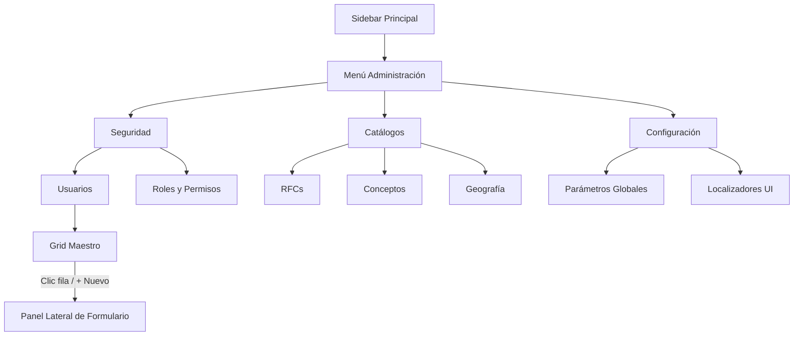

# SAR-ADM-001
## Diseño Funcional y Arquitectura UI/UX
### Módulo de Administración del Sistema (SAR)

**Documento:** SAR-ADM-001
**Versión:** 1.0
**Estado:** Propuesta de Análisis
**Metodología:** Business-First Architecture (BFA)

---

## 1. Alcance Funcional

El Módulo de Administración permitirá gestionar la información base de configuración, catálogos y seguridad del Sistema de Administración de Referencias (SAR). 

### 1.1 Esquemas y Tablas Administrables

#### A. Esquema `sar_seguridad`
*   **usuario**: Alta, edición, desactivación (baja lógica).
*   **rol**: Definición de perfiles operativos.
*   **modulo** y **accion**: Registro de módulos y acciones protegidas.
*   **permiso**: Asociación Modulo + Accion.
*   **Asignaciones (Tablas intermedias)**: `usuario_rol`, `rol_permiso`.
*   *Nota*: La tabla `sesion` se considerará de **sólo lectura** para monitoreo operativo, sin permitir operaciones CUD manuales para garantizar integridad de auditoría.

#### B. Esquema `sar_catalogo`
*   **municipio** y **delegacion**: Gestión geográfica. Dependencia: Delegación requiere Municipio. Se soporta `codigo_portal` para ambas entidades, lo que permite la vinculación directa con el Bot.
*   **concepto**: Catálogo de conceptos de referencias, soportando `codigo_portal`.
*   **rfc**: Alta, edición, desactivación de contribuyentes base, con información de domicilio completa en 2 columnas.
*   **estado_sistema** y **evento_sistema**: Catálogos estáticos de estados transaccionales (generalmente de sólo lectura o edición controlada).

#### C. Esquema `sar_configuracion`
*   **parametro_sistema**: Configuración de variables globales (e.g. `TAMANO_LOTE`, `TIEMPO_HEARTBEAT`).
*   **localizador_portal**: Selectores dinámicos del bot Playwright.

### 1.2 Dependencias y Restricciones
*   **Integridad Referencial**: No se permitirá la eliminación física (`DELETE`) de registros que posean referencias en esquemas de producción o auditoría.
*   **Eliminación Lógica**: Toda acción de "Eliminar" se transformará en un `UPDATE tabla SET activo = FALSE`.
*   **Catálogos Maestros**: `rfc`, `concepto`, `municipio`.
*   **Catálogos Dependientes**: `delegacion` (depende de `municipio`).

---

## 2. Seguridad y Modelo de Permisos (RBAC)

Se implementará un Control de Acceso Basado en Roles (RBAC) granular aprovechando la estructura de `Permiso` (Módulo + Acción).

*   **Módulo Administrador**: Se requiere un rol especial (e.g., `SUPERADMIN` o `ADMIN_SISTEMA`).
*   **Permisos Base**: 
    *   `MOD_SEGURIDAD` + `LEER` / `CREAR` / `EDITAR` / `DESACTIVAR`
    *   `MOD_CATALOGOS` + `LEER` / `CREAR` / `EDITAR` / `DESACTIVAR`
    *   `MOD_CONFIGURACION` + `LEER` / `EDITAR` (La creación suele estar restringida al desarrollador).
*   Todo acceso a las vistas de administración validará estos permisos de forma cruzada contra la sesión activa en backend y en UI.

---

## 3. Casos de Uso e Historias de Usuario

### Casos de Uso Principales
1.  **CU-ADM-01**: Gestionar Usuarios y Roles.
2.  **CU-ADM-02**: Administrar Catálogos (RFCs, Conceptos, Geografía).
3.  **CU-ADM-03**: Modificar Parámetros de Operación y Localizadores.

### Historias de Usuario Destacadas
*   **HU01 - Gestión de Usuarios**: *Como Administrador del Sistema, quiero poder dar de alta un nuevo usuario, asignarle roles y desactivarlo si deja la empresa, para controlar quién ingresa al SAR.*
*   **HU02 - Diccionario de Datos Dinámico**: *Como Administrador del Sistema, quiero interactuar con tablas de catálogos mediante una grilla uniforme que me permita filtrar y paginar registros rápidamente sin sobrecargar la interfaz.*
*   **HU03 - Auditoría de Cambios**: *Como Oficial de Seguridad, quiero que cuando un administrador cambie un parámetro (ej. límite de lotes), el sistema registre el valor viejo y el valor nuevo en la bitácora de auditoría.*

---

## 4. Experiencia de Usuario (UI/UX) y Diseño de Navegación

Siguiendo el principio de **Atomic Design**, la interfaz será reutilizable y consistente. El flujo maestro constará de:
1.  Un **Sidebar de Administración** o Menú Superior en Barra.
2.  Una **Vista de Grid (Master)** con paginación, filtros de columna y botón `+ Nuevo`. Se soporta doble-clic para edición de registros, y clic simple para selección maestro-detalle. Los elementos seleccionados destacan usando color de Acento para contraste óptimo.
3.  Un **Panel Lateral / Formulario Modal (Detail)** para Creación y Edición, para no perder el contexto de la lista. Formularios extensos (como RFC) utilizan grillas de 2 columnas para optimizar espacio vertical.

### 4.1 Diseño de Navegación



### 4.2 Wireframe Conceptual (Vista de Grid + Formulario)

> [!NOTE]
> Para minimizar la fricción cognitiva, usar un "Sliding Panel" (panel lateral derecho) al seleccionar o crear un registro es más eficiente que navegar a una nueva pantalla.

```text
+-------------------------+---------------------------------------------------+
| SIDEBAR                 | BREADCRUMB: Inicio > Administración > Usuarios    |
|                         |                                                   |
| > Dashboard             | +-----------------------------------------------+ |
| > Órdenes               | | [Buscar...]   [Filtro: Activos ▼]   [+ Nuevo] | |
| > Solicitudes           | +-----------------------------------------------+ |
| > Referencias           |                                                   |
|                         |  GRID MAESTRO                                     |
| v ADMINISTRACIÓN        |  Usuario  | Nombre      | Rol       | Estado      |
|   - Usuarios            |  admin    | Admin Base  | SUPER     | [Activo]    |
|   - Roles               |  oper1    | Operador 1  | CAPTURISTA| [Activo]    |
|   - Conceptos           |                                                   |
|   - RFCs                |                                                   |
|                         | (Paginación: < 1 2 3 >)                           |
+-------------------------+---------------------------------------------------+
```

---

## 5. Arquitectura y Escalabilidad

Para que la adición de nuevos esquemas o tablas en el futuro no requiera codificar nuevas pantallas manuales, se propone una **Arquitectura Basada en Metadatos**.

### 5.1 Motor de Formularios y Grillas Dinámicas
Crear un componente en PySide6 llamado `DynamicCrudView`:
1.  **Entrada**: Recibe un "Diccionario de Metadatos" (JSON o Data Class) que describe la tabla.
    ```json
    {
      "table": "sar_seguridad.usuario",
      "endpoint": "/api/usuarios",
      "columns": [
         {"name": "username", "label": "Usuario", "type": "string", "required": true, "grid": true},
         {"name": "password_hash", "label": "Contraseña", "type": "password", "required": true, "grid": false},
         {"name": "activo", "label": "Estado", "type": "boolean", "required": false, "grid": true}
      ]
    }
    ```
2.  **Procesamiento**: El frontend de PySide6 genera la grilla leyendo las columnas donde `"grid": true` y genera el panel de edición renderizando los inputs acordes a `type` (e.g. `LabeledInput` con o sin password mask).
3.  **Ventaja**: Para exponer un catálogo nuevo, solo se agregará un objeto de metadatos, sin programar una nueva UI.

---

## 6. Validaciones

*   **Negocio**: Verificación de existencia previa antes del `INSERT` para campos `UNIQUE` (ej. `username`, `rfc`, `codigo_portal`).
*   **Integridad Referencial**: Los inputs tipo `foreign_key` (ej. Delegación seleccionando Municipio) se renderizarán como `QComboBox` filtrados y validados.
*   **Tipos de Datos**: Validación de expresiones regulares (ej. formato RFC 12/13 caracteres), límites de longitud y obligatoriedad bloqueando el botón de Guardar si existen errores.
*   **UX**: Alertas y delineados rojos (Atomic Design Tokens) directamente sobre el campo de error, no mediante pop-ups invasivos de sistema operativo, salvo en errores catastróficos.

---

## 7. Auditoría y Trazabilidad

Todo guardado transaccional desde el módulo de administración invocará a `AuditRepository.log_evento`:

1.  **Entidad**: `AuditoriaEvento`.
2.  **Datos Recabados**:
    *   `usuario_id` y `sesion_id` que ejecutó la acción.
    *   `modulo`: (e.g., "ADMIN_USUARIOS", "ADMIN_CATALOGOS").
    *   `evento_codigo`: "CREAR_REGISTRO", "ACTUALIZAR_REGISTRO", "DESACTIVAR_REGISTRO".
    *   `valor_anterior`: Diccionario JSON de la fila antes del update.
    *   `valor_nuevo`: Diccionario JSON con los campos insertados/modificados.
3.  **Consulta**: Una pestaña especial de auditoría permitirá a nivel de fila consultar su historial "Ver Historial de Cambios", proporcionando una trazabilidad total del dato (quién, cuándo y desde dónde se modificó).

---

## 8. Riesgos y Recomendaciones

### Riesgos Identificados
*   **Contención de Base de Datos**: Editar catálogos ampliamente usados en el momento de una ejecución masiva del bot podría generar bloqueos.
*   **Complejidad de UI Dinámica**: El motor de metadatos es altamente escalable, pero añade complejidad de desarrollo inicial.

### Recomendaciones Estratégicas
1.  **Desarrollo Iterativo**: Construir la versión 1.0 del CRUD solo para las 4 tablas críticas (`Usuario`, `RFC`, `Concepto`, `ParametroSistema`) mediante vistas estáticas pero reutilizando componentes Atómicos. Implementar el motor dinámico en la versión 2.0.
2.  **Caché en Frontend**: Dado que catálogos como Concepto o EstadoSistema cambian raramente, la UI debe cachearlos tras el login, e implementar un botón para "Refrescar Caché" o refrescarlos pasivamente en *background*, evitando saturar la base de datos con SELECTs por cada renderizado de combobox.
3.  **Manejo de Contraseñas Seguras**: El CRUD de Usuarios nunca debe traer el hash desde backend a la vista. El campo contraseña solo servirá para establecer una nueva y viajará hasheada o será validada contra políticas de fortaleza.
