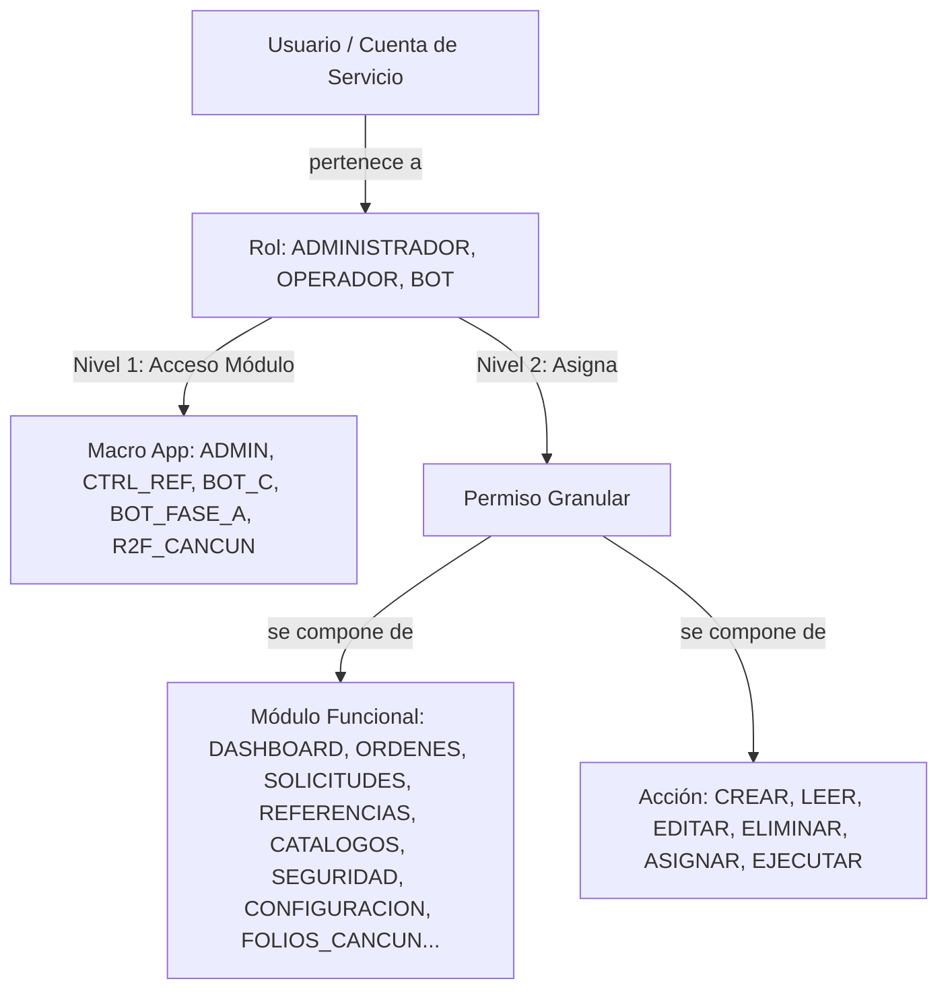

# SAR-SEC-001: Arquitectura de Seguridad y Auditoría
**Categoría:** Seguridad  
**Versión:** 1.0  
**Estado:** Baseline Congelada  
**Metodología:** Business-First Architecture (BFA)  

1. Objetivo

Definir la arquitectura de seguridad, control de acceso, auditoría y trazabilidad del Sistema de Administración de Referencias (SAR).

El objetivo principal es garantizar:

Integridad
Trazabilidad
Disponibilidad
No repudio
Recuperación operativa
2. Principios de Seguridad
SEC-001

Toda operación debe estar asociada a un usuario autenticado.

SEC-002

Toda acción relevante debe quedar auditada.

SEC-003

Ningún usuario tendrá acceso directo a PostgreSQL.

Acceso exclusivamente mediante:

SAR Desktop
      ↓
FastAPI
      ↓
PostgreSQL
SEC-004

Las referencias generadas nunca podrán eliminarse físicamente.

SEC-005

Toda modificación crítica deberá conservar historial.

3. Modelo de Autenticación
Método Oficial
Usuario
+
Contraseña
Futura Evolución

Preparar compatibilidad para:

LDAP
Active Directory
Azure AD
4. Gestión de Sesiones
Regla Oficial

Un usuario puede iniciar sesión desde múltiples equipos.

Motivo:

En SAR el recurso crítico es la:

SOLICITUD

No la sesión.

Ejemplo:

Juan

Equipo A
Equipo B
Equipo C

Permitido.

5. Identidad Operativa

Diferenciar:

USUARIO

de

SESIÓN ACTIVA

Usuario:

Persona

Sesión:

Instancia de trabajo

Ejemplo:

Usuario:
Juan Pérez

Sesiones:

PC-01

PC-02

Laptop
6. Roles Oficiales

### Administrador (`ADMINISTRADOR`)
Control total del sistema (Super Admin).
- **Alcance**: Gestión completa de usuarios, roles, permisos, catálogos, configuración, parámetros, procesos especiales y auditoría.
- **Acceso a Macro Apps**: `ADMIN`, `CTRL_REF`, `BOT_C`, `BOT_FASE_A`, `R2F_CANCUN`.

### Operador (`OPERADOR`)
Control de producción, captura de órdenes, gestión de inventario y ejecución interactiva de scrapers.
- **Alcance**: Creación y seguimiento de órdenes, asignaciones de inventario a notarías/colaboradores, consulta de referencias y facturas.
- **Acceso a Macro Apps**: `CTRL_REF`, `BOT_C`, `BOT_FASE_A`, `R2F_CANCUN`.

### Bot de Automatización (`BOT`)
Cuenta de servicio no humana (*Service Account*) para procesamiento desatendido de solicitudes en cola.
- **Alcance (Principio de Mínimo Privilegio - PoLP)**:
  - `CATALOGOS:LEER`: Consulta de RFCs, conceptos y delegaciones requeridos para el portal Tributanet.
  - `CONFIGURACION:LEER`: Consulta de localizadores CSS/XPath y parámetros de timeout/reintentos.
  - `SOLICITUDES:LEER`: Detección y bloqueo transaccional de solicitudes en estado `PENDIENTE`.
  - `SOLICITUDES:EDITAR`: Transición de estados (`EN_PROCESO`, `COMPLETADA`, `ERROR`) y registro de métricas.
  - `SOLICITUDES:EJECUTAR`: Reclamo con bloqueo de fila (`SELECT ... FOR UPDATE`) y ciclo de scraping.
  - `REFERENCIAS:CREAR`: Inserción física de la referencia emitida y registro de archivo PDF generado.
  - `REFERENCIAS:LEER`: Verificación de idempotencia previa a inserción (`exists_by_portal_ref`).
- **Restricciones Estrictas**: Denegado acceso a `SEGURIDAD`, denegada eliminación (`ELIMINAR`) en todos los módulos, y denegada edición en `CATALOGOS` y `CONFIGURACION`.
- **Acceso a Macro Apps**: `BOT_C`, `BOT_FASE_A`.

7. Arquitectura de Control de Acceso en Dos Niveles

El sistema SAR implementa una estrategia de control de acceso basada en roles (RBAC) estructurada en dos niveles independientes y complementarios:

### Nivel 1: Validación de Acceso al Módulo (Macronivel - `app_modulo`)
Antes de instanciar cualquier vista o cargar datos del servidor, el sistema intercepta el login y valida si el rol del usuario tiene asignado el módulo de la aplicación (`app_modulo`) al que intenta entrar:
- `ADMIN`: Módulo de Administración del Sistema SAR.
- `CTRL_REF`: Sistema Principal de Control de Derechos y Referencias SAR.
- `BOT_C`: Bot-C AutoFacturación Tributanet.
- `BOT_FASE_A`: Bot-A Pago de Derechos y Generación de Referencias.
- `R2F_CANCUN`: Aplicación Satélite Independiente de Recibos y Facturas Cancún.

Las relaciones se definen en la tabla asociativa `sar_seguridad.rol_app_modulo` administrada desde el panel de Roles.

### Nivel 2: Validación de Permisos de Operación (Micronivel - `permiso`)
Una vez dentro del módulo, las acciones específicas del usuario (`CREAR`, `LEER`, `EDITAR`, `ELIMINAR`, `ASIGNAR`, `EJECUTAR`) se validan contra los permisos granulares asociados a sus roles en la matriz de permisos (`rol_permiso` -> `permiso` -> `modulo` x `accion`).

### Diagrama de Relación y Mapeo de Seguridad (RBAC)

8. Matriz RBAC Canónica

| Módulo / Recurso | Administrador | Operador | Bot (Service Account) |
| :--- | :---: | :---: | :---: |
| **Seguridad (Usuarios/Roles/Permisos)** | Control Total | Denegado | Denegado |
| **Configuración y Localizadores** | Control Total | Lectura | Lectura (`LEER`) |
| **Catálogos Maestros (RFC/Conceptos/Geo)** | Control Total | Lectura / Edición | Lectura (`LEER`) |
| **Órdenes de Generación** | Control Total | Crear / Leer / Editar | Denegado |
| **Solicitudes del Bot** | Control Total | Control Total | Reclamar / Procesar (`LEER`, `EDITAR`, `EJECUTAR`) |
| **Referencias y Facturas** | Control Total | Control Total | Emitir / Verificar (`CREAR`, `LEER`) |
| **Tablero y KPIs (Dashboard)** | Visualizar / Gestionar | Visualizar | Denegado |
| **CancúnBot Satélite (`FOLIOS/RECIBOS`)** | Control Total | Asignado por Perfil | Denegado |
| **Auditoría y Bitácoras** | Lectura Completa | Lectura Propia | Auditoría Automática por Sesión |
9. Seguridad de Contraseñas
Hash
Argon2

No almacenar:

Texto plano
MD5
SHA1
10. Seguridad de API
Token
JWT

Tiempo recomendado:

8 horas

Refresh:

24 horas
11. Auditoría Obligatoria

Toda acción deberá registrarse.

Eventos Auditables
Login
LOGIN
Logout
LOGOUT
Crear Orden
ORDEN_CREATE
Modificar Orden
ORDEN_UPDATE
Asignar Solicitud
SOLICITUD_ASSIGN
Generar Referencia
REFERENCIA_CREATE
Cambio Estado
REFERENCIA_STATUS
Reproceso
REFERENCIA_REPROCESS
12. No Repudio

Toda auditoría deberá almacenar:

Usuario

Equipo

IP

Fecha

Hora

Acción

Detalle

Ejemplo:

{
  "usuario":"jperez",
  "equipo":"PC-OPER-01",
  "accion":"REFERENCIA_CREATE",
  "referencia":"123456789",
  "fecha":"2026-07-01 14:32:10"
}
13. Auditoría de Producción
Tabla
auditoria_evento

Objetivo:

Qué hizo
Quién lo hizo
Cuándo lo hizo
Dónde lo hizo
14. Auditoría de Acceso
Tabla
auditoria_login

Registrar:

Inicio

Cierre

Sesión

IP

Equipo
15. Auditoría de Errores
Tabla
auditoria_error

Registrar:

Excepción

Stack Trace

Usuario

Módulo

Fecha
16. Seguridad de PDFs

Los PDFs representan evidencia operativa.

Política

Prohibido eliminar.

Estados permitidos:

Activo

Archivado
17. Integridad de Archivos

Cada PDF almacenará:

SHA256

Objetivo:

Detectar:

Corrupción

Manipulación

Sustitución
18. Recuperación Operativa
Checkpoints

Obligatorios.

Permiten continuar:

Solicitud
↓
Referencia 850
↓
Falla eléctrica
↓
Reanudar desde 851
19. Seguridad de Concurrencia

Problema:

5 usuarios
10 usuarios
20 usuarios

trabajando simultáneamente.

Solución:

SELECT ... FOR UPDATE

sobre:

grupo_referencia

Garantía:

Cero duplicados

en consecutivos.

20. Respaldo
Base de Datos

Diario.

PDFs

Diario.

Auditoría

Diaria.

Retención:

5 años
21. Monitoreo

Indicadores:

Usuarios Activos
Sesiones Activas
Solicitudes Procesándose
Referencias Generadas
Errores por Hora
22. Riesgos Identificados
R-001

Cambio de estructura Tributanet.

R-002

Bloqueo temporal portal.

R-003

Falla eléctrica.

R-004

Falla de red.

R-005

Manipulación de archivos.

R-006

Acceso indebido.

23. Controles Mitigantes
Riesgo	Mitigación
Duplicidad	FOR UPDATE
Manipulación PDF	SHA256
Falla eléctrica	Checkpoint
Usuario indebido	RBAC
Cambio portal	Versionado Bot
Eliminación accidental	Archivado
Decisiones Congeladas
SEC-001

RBAC obligatorio.

SEC-002

JWT obligatorio.

SEC-003

Argon2 obligatorio.

SEC-004

Auditoría obligatoria.

SEC-005

PDFs no eliminables.

SEC-006

Checkpoints obligatorios.

SEC-007

Múltiples sesiones por usuario permitidas.

SEC-008

Consecutivos protegidos mediante bloqueo transaccional.