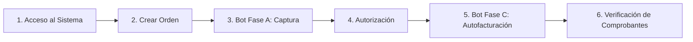
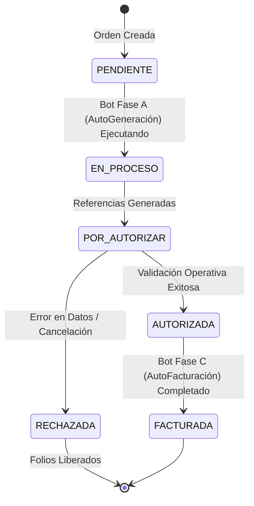

# 📘 Manual de Operación de Usuario Final — Sistema SAR
**Versión:** 1.0  
**Fecha de Emisión:** Marzo 2026  
**Sistema:** SAR (Sistema de Administración de Referencias)  
**Audiencia:** Operadores de Captura, Asistentes Administrativos, Facturación y Supervisores  

---

## 📌 Control del Documento y Notas de Edición

> [!NOTE]
> **Para el redactor/editor del manual:**  
> Este documento contiene marcadores visuales señalizados con el icono 📸 `> 📸 [Captura de Pantalla: ...]`. Reemplaza estos bloques con las capturas de pantalla reales de la aplicación `SAR_Cliente.exe` a medida que realices los flujos en el sistema. Las imágenes pueden organizarse en la carpeta `sar/doc_sar/assets/manual/`.

---

# 1. Introducción al Sistema SAR

## 1.1 ¿Qué es SAR?
El **Sistema de Administración de Referencias (SAR)** es la herramienta centralizada de escritorio para la captura, control, asignación, generación automatizada (Tributanet) y autofacturación de referencias de pago de derechos.

## 1.2 Objetivos Principales
* **Cero Errores Fiscales:** Validación rigurosa de empresas, RFCs y domicilios antes de la emisión.
* **Automatización Confiable:** Generación desatendida de referencias y comprobantes fiscales (PDF / XML).
* **Trazabilidad Total:** Control en tiempo real del ciclo de vida de cada orden y sus folios.

## 1.3 Conceptos Básicos que Debes Conocer

| Término | Definición Operativa |
| :--- | :--- |
| **Orden** | Solicitud principal que agrupa uno o varios derechos/conceptos para una empresa determinada. |
| **Referencia** | Cadena alfanumérica única emitida por el portal externo (Tributanet) que identifica la línea de pago. |
| **Derecho / Concepto** | Trámite específico a pagar (ej. inscripción, certificación, derechos notariales). |
| **Lote / Folio** | Unidad de inventario asignada a una orden para control interno de consumo. |
| **Autofacturación** | Proceso automatizado de descarga y vinculación de comprobantes fiscales (XML y PDF). |

## 1.4 Flujo General de Trabajo Diario

---

# 2. Acceso al Sistema y Gestión de Sesión

## 2.1 Inicio de Sesión
1. Ejecuta el acceso directo **SAR_Cliente** en tu escritorio.
2. Ingresa tu **Nombre de Usuario** y **Contraseña**.
3. Haz clic en el botón **Ingresar**.

> 📸 **[Captura de Pantalla recomendada: Ventana de Login con campos de usuario, contraseña y botón Ingresar]**

> [!IMPORTANT]
> Las credenciales son personales e intransferibles. Cualquier movimiento u orden generada quedará registrada en la bitácora de auditoría con tu usuario.

## 2.2 Qué hacer ante credenciales incorrectas
* Si el sistema muestra el mensaje *"Usuario o contraseña incorrectos"*, verifica que la tecla `Bloq Mayús` no esté activa.
* Si el problema persiste tras 3 intentos, solicita el restablecimiento de tu contraseña al Administrador de TI.

## 2.3 Cierre de Sesión Seguro
* Para salir del sistema de forma ordenada, haz clic en tu nombre de usuario en la esquina superior derecha y selecciona **Cerrar Sesión**, o cierra la ventana principal. Esto liberará los bloqueos temporales que tu sesión pudiera tener activos.

---

# 3. Navegación Principal y Módulos Operativos

La interfaz de SAR se divide en tres zonas principales:
1. **Barra Superior (Navbar):** Muestra el usuario activo, estado de la conexión a la base de datos y botón de salida.
2. **Menú Lateral:** Acceso directo a los módulos operativos.
3. **Área de Trabajo Central:** Espacio donde se cargan formularios, tablas y bitácoras.

> 📸 **[Captura de Pantalla recomendada: Ventana Principal mostrando el Menú Lateral y el Tablero de Inicio]**

## Guía Rápida de Módulos

| ¿Qué tarea necesitas realizar? | Módulo al que debes ingresar |
| :--- | :--- |
| Crear una orden nueva, consultar estatus o autorizar | 📂 **Control de Referencias y Órdenes** |
| Ejecutar la generación de referencias en Tributanet | 🤖 **Bot Fase A — AutoGeneración de Derechos** |
| Descargar facturas, XMLs y comprobantes fiscales | 🧾 **Bot Fase C — AutoFacturación de Derechos** |
| Consultar históricos y descargar reportes en Excel | 📊 **Consultas y Reportes** |

---

# 4. Módulo 1: Control de Referencias y Órdenes

## 4.1 Validaciones Previas Obligatorias (Regla de Oro)

> [!CAUTION]
> **REGLA DE ORO:** Antes de hacer clic en "Guardar Orden", verifica obligatoriamente que el **Nombre de la Empresa**, su **RFC** y el **Domicilio Fiscal** correspondan exactamente a la documentación fuente.  
> **Consecuencia:** Una orden generada con datos fiscales incorrectos causará el rechazo en Tributanet o la emisión de comprobantes fiscales no deducibles.

### Lista de Chequeo Previo:
* [ ] La empresa seleccionada está activa en el catálogo.
* [ ] El RFC coincide caracter por caracter con la Cédula Fiscal.
* [ ] Si la empresa tiene múltiples direcciones, se seleccionó la sucursal/domicilio correspondiente al trámite.

---

## 4.2 Creación de una Nueva Orden (Paso a Paso)

1. Ingresa al módulo **Control de Referencias**.
2. Haz clic en el botón superior **➕ Nueva Orden**.
3. En la ventana emergente:
   * **Empresa:** Escribe el nombre o RFC y selecciónala de la lista desplegable.
   * **Dirección Fiscal:** Confirma la dirección que se autocompleta.
   * **Concepto / Trámite:** Selecciona el tipo de derecho a solicitar.
   * **Cantidad:** Indica el número de referencias requeridas.
   * **Observaciones:** (Opcional) Agrega notas internas de control.
4. Haz clic en **Guardar Orden**.

> 📸 **[Captura de Pantalla recomendada: Formulario de Nueva Orden con datos de empresa, concepto y dirección completados]**

5. El sistema confirmará la creación mostrando el número de orden asignado (Ejemplo: `ORD-2026-00142`).

---

## 4.3 Ciclo de Vida y Estados de una Orden

## 4.4 Autorización y Rechazo de Órdenes

### Procedimiento de Autorización:
* **¿Cuándo autorizar?** Cuando el **Bot Fase A (AutoGeneración de Derechos)** haya terminado de generar las referencias y hayas verificado visualmente que el importe y la línea de captura son correctos.
* **Acción:** Selecciona la orden en la tabla y haz clic en el botón **✅ Autorizar**.
* **Efecto:** La orden pasa a estado `AUTORIZADA`, quedando lista para el proceso de AutoFacturación.

> 📸 **[Captura de Pantalla recomendada: Diálogo de confirmación de Autorización de Orden]**

### Procedimiento de Rechazo:
* **¿Cuándo rechazar?** Si detectas un error en el importe, concepto equivocado, o si el solicitante canceló el trámite.
* **Acción:** Selecciona la orden y haz clic en **❌ Rechazar**.
* **Motivo obligatorio:** El sistema solicitará que captures obligatoriamente el motivo del rechazo en el cuadro de texto.
* **Efecto:** La orden pasa a estado `RECHAZADA` y los derechos/folios reservados se liberan automáticamente en el inventario.

---

# 5. Módulo 2: Bot Fase A — AutoGeneración de Derechos

El **Bot Fase A (AutoGeneración de Derechos)** se encarga de abrir de forma controlada la plataforma externa (Tributanet), capturar los datos de la orden y obtener la referencia de pago oficial y su boleta en PDF.

> 📸 **[Captura de Pantalla recomendada: Panel del Bot Fase A (AutoGeneración de Derechos) con lista de órdenes pendientes y botón Iniciar Proceso]**

## 5.1 Ejecución del Bot
1. Ingresa al módulo **Bot Fase A (AutoGeneración de Derechos)**.
2. Verás la lista de órdenes en estado `PENDIENTE`.
3. Marca la casilla de las órdenes que deseas procesar (o selecciona *Procesar Todo*).
4. Haz clic en **▶️ Iniciar Generación**.

## 5.2 Supervisión y Monitoreo
* Durante la ejecución, observa la **Barra de Progreso** y la **Bitácora de Eventos** en la parte inferior.
* **No cierres el sistema** mientras el indicador muestre `Procesando...`.

> 📸 **[Captura de Pantalla recomendada: Barra de progreso activa y registro de bitácora del Bot Fase A (AutoGeneración de Derechos)]**

## 5.3 Qué hacer ante un error o detención
* **Timeout o lentitud de portal:** Si el portal externo tarda en responder, el sistema reintentará automáticamente 3 veces.
* **Si el bot se detiene en rojo:** La bitácora indicará la razón (ej. *"Portal Tributanet no disponible"* o *"RFC no registrado en padrón"*). Consulta el Capítulo 9 para la solución rápida.

---

# 6. Módulo 3: Bot Fase C — AutoFacturación de Derechos

El **Bot Fase C (AutoFacturación de Derechos)** toma las órdenes autorizadas y descarga los comprobantes fiscales correspondientes (archivos XML y PDF timbrados).

> 📸 **[Captura de Pantalla recomendada: Módulo de AutoFacturación de Derechos (Bot Fase C) con selección de órdenes autorizadas y visor de rutas]**

## 6.1 Pasos Operativos
1. Ingresa al módulo **AutoFacturación de Derechos (Bot Fase C)**.
2. Selecciona las órdenes en estado `AUTORIZADA`.
3. **Verificación de Rutas:** Confirma que la carpeta de destino sea la ruta oficial de tu estación de trabajo o red.
4. Haz clic en **⚡ Iniciar Autofacturación**.
5. Al concluir, el sistema mostrará el resumen: *"X Facturas generadas exitosamente"*.

---

# 7. Verificación de Archivos y Comprobantes

> [!IMPORTANT]
> Ninguna orden debe darse por finalizada sin haber comprobado físicamente la existencia y legibilidad de sus archivos.

## 7.1 Convención de Nombres y Extensiones

| Tipo de Archivo | Formato | Ejemplo de Nombre | Ubicación Recomendada |
| :--- | :---: | :--- | :--- |
| **Boleta de Pago** | `.pdf` | `BOLETA_ORD142_REF88392.pdf` | `C:\SAR_Descargas\Boletas\` |
| **Factura Fiscal** | `.pdf` | `FACTURA_F29384.pdf` | `C:\SAR_Descargas\Facturas\` |
| **Comprobante Fiscal** | `.xml` | `FACTURA_F29384.xml` | `C:\SAR_Descargas\Facturas\` |

## 7.2 Checklist de Verificación de Archivos
Antes de archivar o enviar comprobantes al cliente:
- [ ] El archivo fue descargado en la carpeta designada.
- [ ] El tamaño del archivo es mayor a 0 KB (no está corrupto).
- [ ] Al abrir el PDF, el RFC y la Razón Social coinciden con la orden.
- [ ] El importe total coincide con el desglose autorizado.
- [ ] El archivo XML se encuentra presente junto con su PDF.

---

# 8. Consultas y Reportes Operativos

1. Ingresa a **Consultas y Reportes**.
2. Utiliza los filtros superiores para acotar tu búsqueda:
   * **Rango de Fechas:** Fecha inicial y fecha final.
   * **Empresa / RFC:** Filtrar por cliente específico.
   * **Estado:** `PENDIENTE`, `AUTORIZADA`, `RECHAZADA`, `FACTURADA`.
3. Haz clic en **🔍 Buscar**.
4. Para exportar la relación a Excel, haz clic en **📊 Exportar a CSV / Excel**.

> 📸 **[Captura de Pantalla recomendada: Pantalla de Reportes con filtros aplicados y tabla de resultados]**

---

# 9. Solución de Problemas y Errores Frecuentes

### Caso 1: "RFC o Domicilio Fiscal no coincide"
* **Causa:** Datos capturados diferentes a la Cédula de Identificación Fiscal.
* **Solución:** Cancela la captura actual, verifica la Cédula Fiscal física o solicita al Administrador actualizar el catálogo de empresas antes de volver a crear la orden.

### Caso 2: "Sin inventario / folios disponibles para el concepto"
* **Causa:** Se agotaron los paquetes de folios precargados para ese tipo de derecho.
* **Solución:** Notifica al Administrador del Sistema para que inyecte un nuevo lote de folios desde el módulo de administración.

### Caso 3: "Error de Conexión con Tributanet en Bot Fase A"
* **Causa:** Caída temporal del portal gubernamental o interrupción de internet.
* **Solución:** Espera 5 minutos y haz clic en *Reintentar*. Si el portal externo sigue caído, pausa la cola de trabajo y notifica a supervisión.

### Caso 4: "Comprobante XML/PDF no aparece en la carpeta"
* **Causa:** La ruta de red no está disponible o no se tienen permisos de escritura.
* **Solución:** Verifica que la unidad de red esté conectada en Windows (`Z:\` o ruta UNC). Vuelve a ejecutar la descarga individual desde la tabla de órdenes.

---

# 10. Las 7 Reglas de Oro del Operador SAR

1. 🔍 **Verifica siempre el RFC y la Empresa** antes de hacer clic en Guardar.
2. 🚫 **No repitas clics en "Iniciar Bot"** si la barra de progreso ya está en marcha.
3. 👁️ **Revisa las referencias generadas** antes de proceder a la Autorización.
4. 📝 **Registra siempre un motivo claro** cuando tengas que rechazar una orden.
5. 📂 **Comprueba que los archivos PDF y XML existan físicamente** y no pesen 0 KB.
6. 🔒 **Cierra tu sesión** al retirarte de tu equipo de cómputo.
7. ⚠️ **Ante cualquier comportamiento anómalo**, no intentes forzar procesos; avisa de inmediato a soporte.
